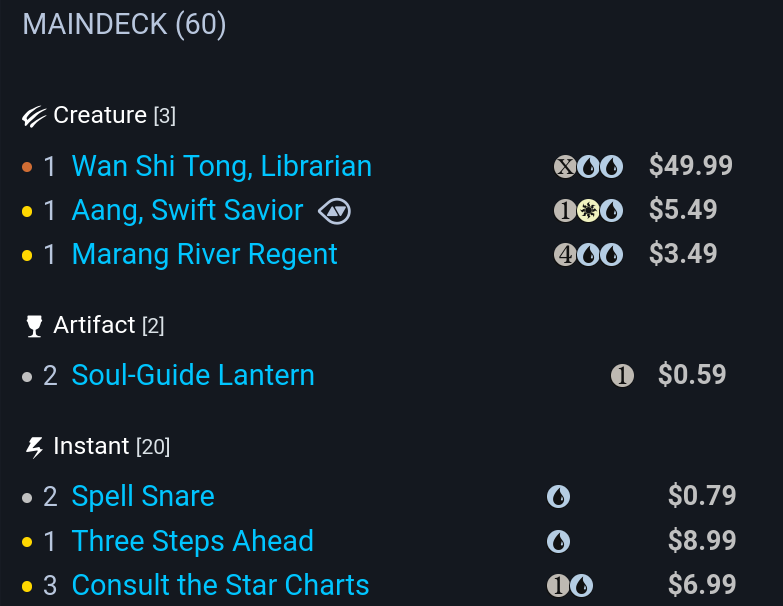
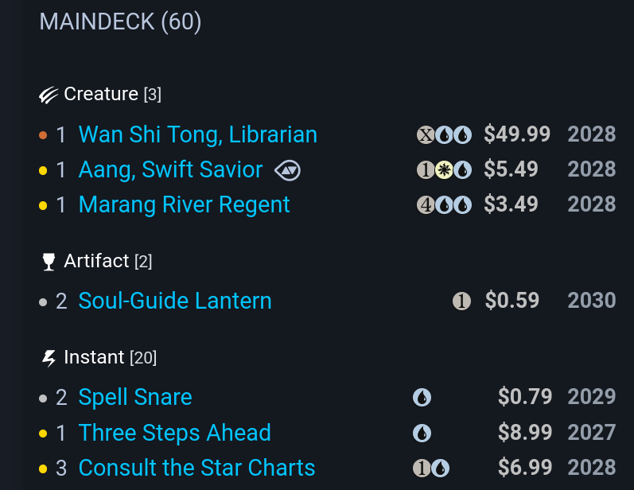

# MTG-Card-Age

## Description
Shows when Magic cards fall out of rotation on the https://mtgdecks.net/Standard deck overview. Script(s) are written for the browser add-on Violentmonkey.

## Installation
1. Install the browser add-on Violentmonkey.
2. Open Violentmonkey, then choose one install method:
3. Option A (manual): Click `New`, then paste the contents of `scripts/standard_year_annotator.js`.
4. Option B (recommended): Click `Install from URL` and use `https://raw.githubusercontent.com/Drox346/MTG-Card-Age/main/scripts/standard_year_annotator.js`.

Option B makes updates easier, since you can use Violentmonkey's `Update` button later.

## Usage
Runs on decks viewed at `https://mtgdecks.net/Standard/*` and appends a year column to each card row.

## Screenshots
### Before

### After

## Notes
- If a card appears with multiple expansions in the CSV, the script uses the highest available year.
- CSV data is cached for 24 hours before refresh.

## Data
Card data provided by https://mtgjson.com/api/v5/csv/  
Standard validity of expansions provided by https://whatsinstandard.com/
